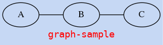

# dot 笔记

[文档](http://www.graphviz.org/pdf/dotguide.pdf)

其实graphviz是围绕着"面-点-线"来组织的.

## 面:

```
<graph|digraph> {
  graph [label="",fontname="",fontsize="",bgcolor="",center];
}
```

graph或者digraph表示生成的图是无向图还是有向图,附带一系列属性.

**面(graph)的基本属性**:

- label为当前图形的名称--`label="XX图"`
- `randdir=TB|LR|RL|BT`表示图的走向,上下还是左右,或者相反
- `fontname=""`设置字体名
- `fontsize=""`设置字体大小
- `fontcolor=""`设置字体颜色
- `bgcolor=""`设置图形背景颜色
- `center`该值为真,则图形会居中绘制

**code-sample**:

```
graph {
  graph [label="graph-sample",
    rankdir=LR;
    fontname="monospace",
    fontsize=14,
    fontcolor="red",
    bgcolor="#c6d8f4"
    center=1]
  A -- B -- C;
}
```



## 点

```
<graph|digraph> {
  graph [label="",fontname="",fontsize="",bgcolor="",center]; 
  node1 [label="",color="",style="",fontcolor="",fontsize="",shape="",];
  node2 [];
  node3 [];
}
```

node1,node2,node3为创建节点名称,也可用其他字符串代替,每个节点都可以使用一些列属性修饰.

**节点(node)基本属性**:

- label就是节点展示的内容
    - 一般使用双引号`label="节点名称"`
    - label内支持`\n`换行--`label="节点名称: \n节点"`
    - label内支持html语法,但是需用尖括号包裹--`label=<<b>加粗</b>;<i>斜体</i>;<u>下划线</u>>
    - `""`包裹的label下可以使用`\n`换行,`\`写多行内容;`<>`包裹的label无需使用`\n 和 \`
  - 如果没有对节点指定label,则节点名就是lable--`A -> B`,就是A到B的连线
- shape就是该节点的形状,[更多](http://www.graphviz.org/doc/info/shapes.html)
    - `shape="box"`就是矩形
    - `shape="circle"`就是圆
    - `shape="ellipse"`就是椭圆
    - `shape="polygon",sides=4,skew=0.4`就是平行四边形,另有侧面长度,倾斜角度属性
    - `shape="none"`就是无边框
- color就是边框的颜色,[更多](http://www.graphviz.org/doc/info/colors.html)
- style节点类型
    - `style="filled", fillcolor=""`就是填充节点区域,多一个fillcolor属性
    - `fillcolor="red:blue"`会产生背景颜色渐变的效果,关于渐变角度,文档中有描述
    - `style="rounded"`就是圆角矩形
    - `style="solid"`就是实线
    - `style="dashed"`就是虚线
    - `style="dotted"`就是虚点线
- URL节点属性,当文件保存为".svg"格式,使用浏览器打开时有效
    - `URL="./index.html"`会连接到此目录下相对文件
    - `URL="http://www.graphviz.org/pdf/dotguide.pdf"`会链接到网站页面
 
**code-sample**

```
digraph {
	graph [label="node-sample"];
	/*shape attribute*/
	node1 [shape=box];
	node2 [shape=circle];
	node3 [shape=ellipse];
	node4 [shape=polygon,sides=4,skew=0.4];
	node5 [shape=none];
	node1 -> node2 -> node3 -> node4 -> node5;
    /*color & \n & html tag*/
	node6 [label="color:\n red",color=red];
	node11 [label=<<b>blod</b>
	<i>italic</i>
	<u>undeline</u>>];
	node12 [label="link2graphviz(.svg)",URL="http://www.graphviz.org/"];
	node13 [label=<
	<table>
		<tr>
			<td>one</td>
			<td>two</td>
		</tr>
	</table>>]
	node6 -> node11 -> node12 -> node13;
    /*style*/
	node7 [style="filled",fillcolor="#c6d8f4"];
	node8 [style="solid"];
	node9 [style="dashed"];
	node10 [style="dotted"];
	node7 -> node8 -> node9 -> node10;
}
```


## 线

```
<graph|digraph> {
  graph [label="",fontname="",fontsize="",bgcolor="",center]; 
  node1 [label="",shape="",];
  node2 [];
  node3 [];
  
  node1 --|-> node2 [label=""];
  node2 --|-> node3 [label=""];
  node3 --|-> node1 [label=""];
}
```

"--"和"->"表示两种连线--无向线和有向线,这些线将各个节点之间连接起来,同时在每个连接线后,我们可以有一系列修饰线的属性.

**线(edge)的基本属性**:

- label就是线的说明--`label="yes/no"`
- style就是连接线的类型
    - `style="solid"`就是实线
    - `style="dashed"`就是虚线
    - `style="dotted"`就是虚点线
    - `style="bold"`就是加粗线
- `arrowxxx`有向图箭头的一些属性,[更多](http://www.graphviz.org/doc/info/arrows.html)
    - `dir="both"`双向箭头
    - `arrowsize=2.0`箭头大小
    - `arrowhead="open"`带倒沟箭头
    - `arrowhead="halfopen"`单边倒沟箭头
    - `arrowhead="diamond|odiamond|ediamond"`菱形,空心菱形
    - `arrowhead="dot"`圆点
- color就是连接线的颜色
    - `color="blue"`普通色
    - `color="red:blue"`双色
    - `color="green:red;0.4:blue"`分段
- URL线属性,当文件保存为".svg"格式,使用浏览器打开时有效
    - `URL="./index.html"`会连接到此目录下相对文件
    - `URL="http://www.graphviz.org/pdf/dotguide.pdf"`会链接到网站页面

**edge-sample**:

```
digraph {
  graph [rankdir=LR,label="edge-sample"];
  A -> a [style=solid,dir=both,arrowhead=dot];
  B -> b [style=dashed,arrowsize=2.0,arrowhead=open,color=blue];
  C -> c [arrowhead=halfopen,color="red:blue"];
  D -> d [style=bold,arrowhead=diamond,color="green:red;0.5:blue"];
  E -> e [style=dotted,label="links(.svg)",URL="https://douban.fm"];
}
```


## 链接

- [colors](https://www.graphviz.org/doc/info/colors.html)
- [shapes](www.graphviz.org/doc/info/shapes.html)
- [arrows](www.graphviz.org/doc/info/arrows.html)

## 更多参考

- 图形属性
    - subgraph, `rank="same|min|max|source|sink"`same表示某两个节点等级相同,[参考](https://stackoverflow.com/questions/25734244/how-do-i-place-nodes-on-the-same-level-in-dot)
    - `rankdir="TB|BT|LR|RL"`表示节点走向,上下,下上,左右,右左
-节点和线的[url-attr](http://safemap.sourceforge.net/demo/index-no-refresh.html)
- [zoomquite-gen4dot2htm](https://github.com/ZoomQuiet/zoomquiet.tangle/blob/master/dot/dotools/gen4dot2htm.py)
- [dot语言笔记](https://github.com/uolcano/blog/issues/13)
