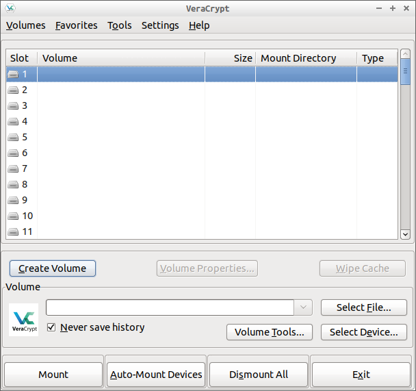
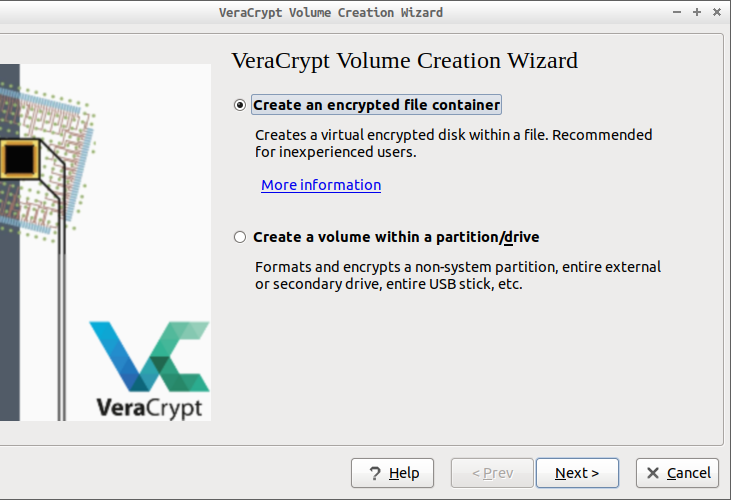
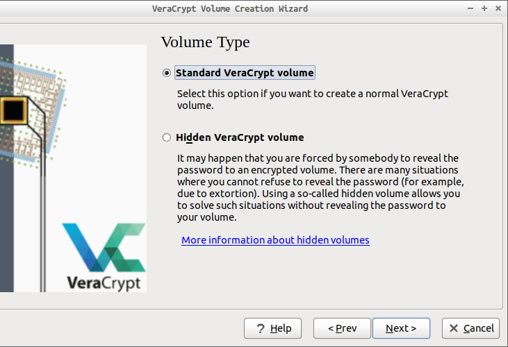

# 加密工具——veracrypt

repo：[veracrypt/VeraCrypt](https://github.com/veracrypt/VeraCrypt)

[Veracrypt](https://www.veracrypt.fr) 是基于TrueCrypt的硬盘加密工具。

使用过程可以跟着软件提示一步步设置使用，下面简介几个概念

## 加密格式

加密格式就是希望创建怎样的的加密空间，加密空间对外是一个实体，无法访问，甚至无法知晓其中是否有内容，因为veracrypt会将非加密文件的空间填充。就像往一个箱子中放入一个物件，填充满沙子，然后再加把锁。在不开锁的情况下，无法知晓里面到底是只是沙子还是有多少物件。

veracrypt可以加密一个**虚拟文件**或**非系统磁盘**，在使用时在软件中像挂载硬盘一样将其添加进软件，然后输入密钥解密。

## 普通格式和隐藏格式

隐藏格式就像是为一个密码箱设置两套密码，不同的密码打开的是不同的空间。以防止在受到胁迫不得不说出密钥时，还能保证数据安全。

在实际操作中，当设置使用隐藏空间后，软件会先引导创建一个普通的加密空间，并会提示你放置一些**非紧要**文件，然后引导设置加密空间。当挂载此加密文件时，如果输入普通空间密钥则进入普通加密空间，输入隐藏空间密钥则进入隐藏加密空间。

## 密钥组成

密钥组成为：`password`+`PIM`（可选）+`keyfiles`（可选）

### password

password就是我们平时使用的 `数字` + `字母` + `符号` 的密钥，如何设置强密钥，可参考 [strong code](strong_code.md)

### PIM

PIM就是“Personal Iterations Multipiler”，是为加密头信息提供的一个阶乘的迭代数，就类似于我们先设置了一个密码“12345”，但是软件肯定不会将此明文密码保存，这时候我们提供一组数字，比如“100”，veracrypt就将我们的密码“12345”，通过某个计算方式计算“100”次，比如乘以“2”，那可能保存的密钥就是“12345×2×2...2”得出的结果。当然veracrypt内部算法肯定不是如此简单。

### keyfiles

keyfiles就是对所添加的keyfiles的前面约“1M”的内容，通过一定的算法同前面的密钥和“PIM”一同加密文件。keyfiles可以是一个文件也可以是多个文件，因为只是用文件头部部分信息进行加密，所以keyfiles没必要过大。veracrypt本身也提供生成keyfiles的功能，但还是使用自己的普通二进制文件（图片如bmp，音乐如wav，压缩包等）更为隐秘，比如一本pdf格式的书，可以放到网盘进行备份。

**由于veracrypt的出色表现，忘记密钥等同丢失文件，对待password，PIM和keyfiles一定要慎重！！！**

**更安全的考虑，可以将password，PIM和keyfiles分开存放！**

更多：[随想](https://program-think.blogspot.com/2011/05/recommend-truecrypt.html#index)

